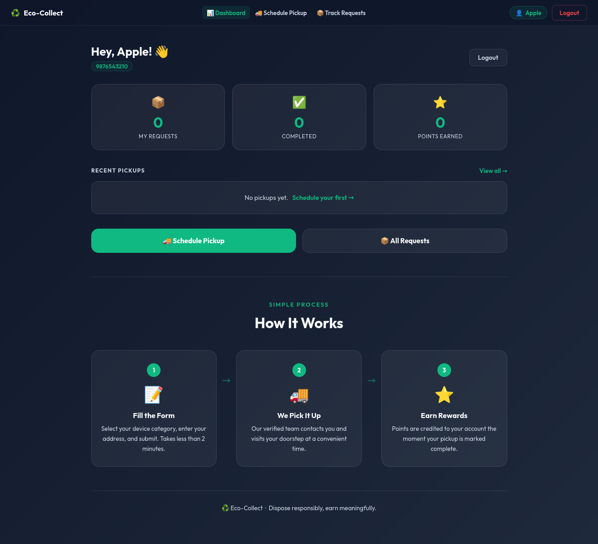
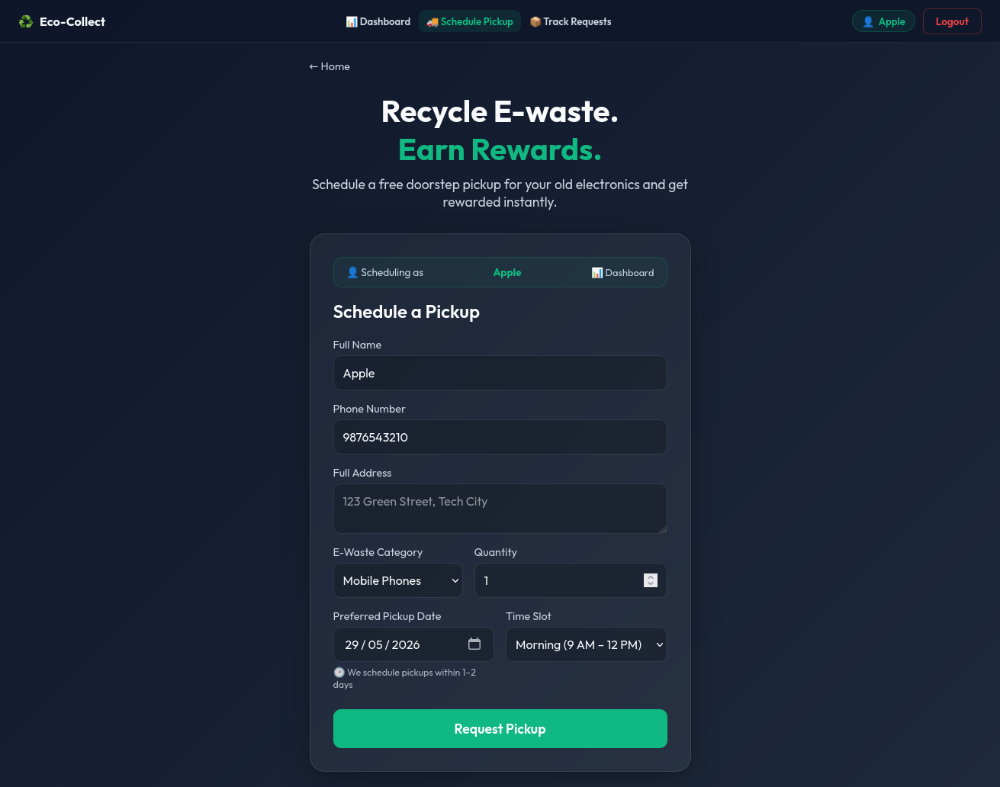
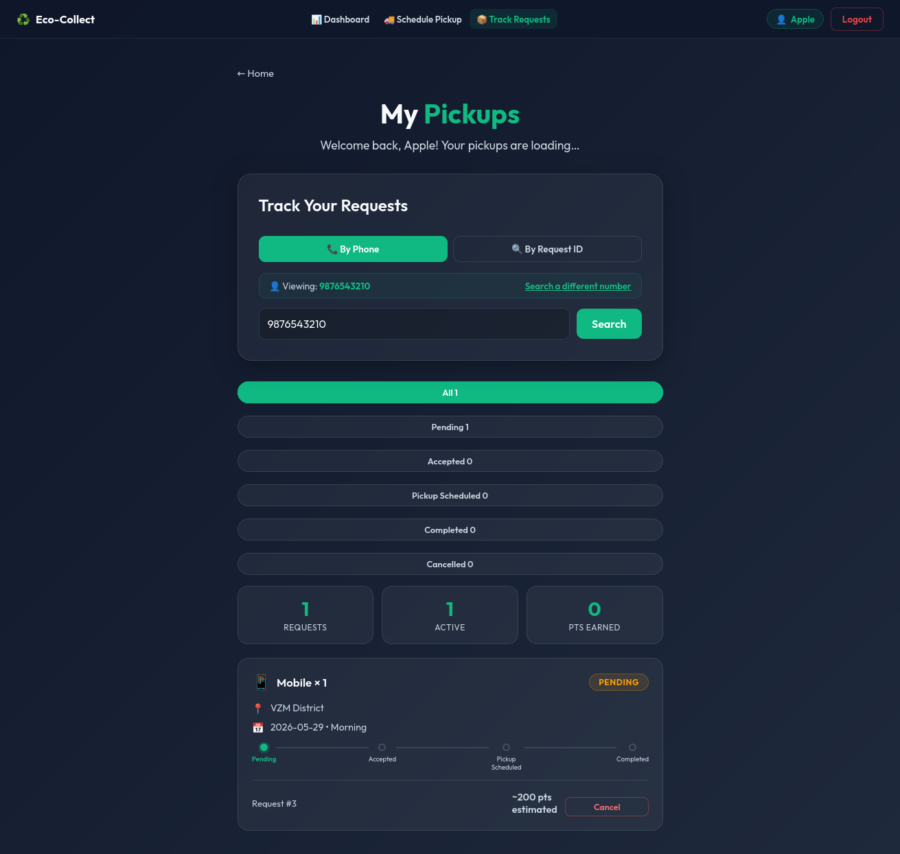
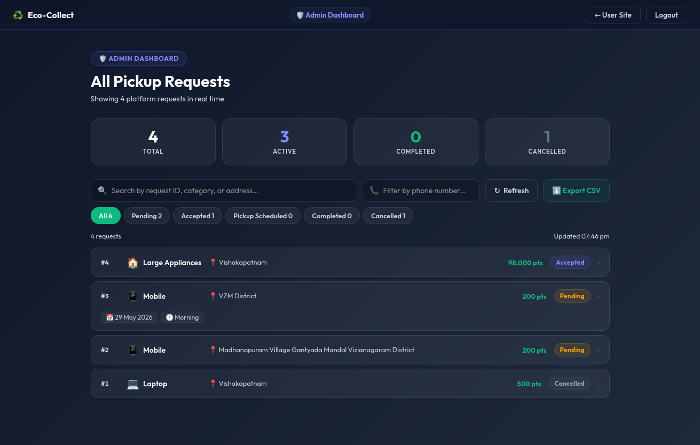

<div align="center">

# ♻️ Eco-Collect — E-Waste Pickup Platform

**A full-stack web application for scheduling free doorstep e-waste pickups, tracking requests in real time, and earning reward points for responsible recycling.**

[](https://your-site.vercel.app)
[](https://e-waste-pickup-platform-j428.onrender.com/docs)
[](https://e-waste-pickup-platform-j428.onrender.com)

</div>

---

## Overview

Eco-Collect connects residents with an e-waste pickup service through a clean, mobile-friendly web interface. Users register via phone number, schedule a free pickup from their doorstep, track the request status in real time, and earn reward points when their items are collected. A separate admin dashboard gives operators full lifecycle control — accepting, scheduling, completing, or cancelling requests — with changes reflected immediately on every user's device.

Built as a solo full-stack project to demonstrate end-to-end product development: REST API design, relational database modeling, client-side state management, and production deployment across two cloud platforms.

---

## Live Demo

| Surface | URL |
|---|---|
| **User App** | `https://e-waste-pickup-platform.vercel.app` *(update after deploy)* |
| **API Swagger Docs** | [e-waste-pickup-platform-j428.onrender.com/docs](https://e-waste-pickup-platform-j428.onrender.com/docs) |
| **Admin Dashboard** | `https://e-waste-pickup-platform.vercel.app/admin-login.html` |

> **Demo credentials**
> - **User:** Enter any 10-digit phone number — new users are registered automatically.
> - **Admin:** Access code `ECO-ADMIN-2024`

> **Note on Render free tier:** The backend may take 30–60 seconds to respond on the first request after a period of inactivity. This is expected behavior on the free plan.

---

## Screenshots

### Home / Dashboard



### Schedule Pickup



### Request Tracking



### Admin Dashboard



---

## Features

### User
- **Phone-based login** — no passwords; instant access via 10-digit phone number with automatic sign-up
- **Schedule a pickup** — select category, quantity, address, preferred date, and time slot; all fields persisted to the database
- **Live status timeline** — visual step-by-step progress tracker: Pending → Accepted → Pickup Scheduled → Completed
- **Cancel a request** — Swiggy/Amazon-style confirmation modal with an optional cancellation reason
- **Track by phone or Request ID** — search all your requests or jump directly to a specific one
- **Recycling certificate** — downloadable PDF certificate generated for every completed pickup
- **Personal dashboard** — total requests, completed pickups, and cumulative reward points at a glance

### Admin
- **5-stage status workflow** — Accept → Schedule Pickup → Complete; Cancel at any stage; Reset Cancelled back to Pending
- **Status persisted to database** — changes via `PATCH /api/requests/{id}/status` are immediately visible to all users on all devices
- **Full request detail modal** — customer name, phone, address, category, quantity, pickup date, time slot, and reward points in one view
- **Search and filter** — search by Request ID, category, or address; filter by phone number; status tabs (All / Pending / Accepted / Pickup Scheduled / Completed / Cancelled)
- **Live stats bar** — real-time counts for Total, Active, Completed, and Cancelled requests
- **Export CSV** — one-click RFC 4180-compliant CSV download with UTF-8 BOM for correct Excel/Google Sheets rendering

---

## Tech Stack

| Layer | Technology |
|---|---|
| **Backend** | Python 3.12 · FastAPI · Uvicorn |
| **Database** | SQLite · SQLAlchemy 2.x ORM · Pydantic v2 |
| **Frontend** | HTML5 · CSS3 · Vanilla JavaScript (no framework) |
| **Deployment** | Render (backend) · Vercel (frontend) |

No frontend build step — the entire UI is plain static files, which eliminates toolchain complexity and makes the architecture easy to understand and extend.

---

## Architecture

```
┌─────────────────────────────┐        ┌─────────────────────────────────┐
│       Vercel (Frontend)     │        │        Render (Backend)         │
│  ─────────────────────────  │        │  ─────────────────────────────  │
│  index.html   → Dashboard   │        │  POST /api/requests             │
│  schedule.html → Form       │◄──────►│  GET  /api/requests/track       │
│  track.html   → Tracking    │  HTTP  │  PATCH /api/requests/{id}/status│
│  admin.html   → Admin       │        │  GET  /admin/requests           │
│  auth.js      → Shared auth │        │                                 │
│  app.js       → Form logic  │        │  FastAPI + SQLAlchemy           │
│  track.js     → Timeline    │        │  SQLite database                │
└─────────────────────────────┘        └─────────────────────────────────┘
```

**Key design decisions:**
- `auth.js` is a shared module loaded by every page — it exposes `API_BASE`, `getUser()`, `requireAuth()`, and `injectNavbar()`, keeping auth and navigation logic in one place.
- The backend normalises Indian phone numbers (strips `+91`, country code, STD prefix) so `9876543210`, `+919876543210`, and `09876543210` all resolve to the same user.
- Admin status changes call `PATCH /api/requests/{id}/status` and commit to SQLite — no localStorage overrides, so every browser and device sees the same state.
- Pydantic v2 `Literal` type enforces valid categories at the schema layer before any database interaction.

---

## Project Structure

```
e-waste-pickup-platform/
│
├── backend/
│   ├── main.py           # FastAPI app — all API endpoints + startup migration
│   ├── models.py         # SQLAlchemy ORM models: User, PickupRequest
│   ├── schemas.py        # Pydantic v2 request/response schemas with validation
│   ├── database.py       # Engine, session factory, DATABASE_URL from env
│   └── requirements.txt
│
└── frontend/
    ├── index.html        # Home / user dashboard (Vercel root)
    ├── login.html        # Phone-based login & sign-up
    ├── schedule.html     # Schedule a pickup form
    ├── track.html        # Track requests by phone or Request ID
    ├── admin-login.html  # Admin access gate
    ├── admin.html        # Admin dashboard (search, filter, status workflow)
    ├── auth.js           # Shared auth utilities, navbar injection, API_BASE
    ├── app.js            # Pickup form submission and validation
    ├── track.js          # Tracking logic, status timeline, cancel modal, certificate
    └── style.css         # Global design system (glassmorphism, dark theme)
```

---

## API Reference

### `POST /api/requests`
Create a new pickup request.

**Request body**
```json
{
  "full_name": "Niharika Modi",
  "phone_number": "9876543210",
  "address": "123 Green Street, Hyderabad",
  "category": "Mobile",
  "estimated_quantity": 2,
  "preferred_date": "2026-06-01",
  "time_slot": "Morning"
}
```

Valid categories: `Mobile` · `Laptop` · `Accessories` · `Large Appliances`

**Response `200`**
```json
{
  "id": 42,
  "address": "123 Green Street, Hyderabad",
  "category": "Mobile",
  "estimated_quantity": 2,
  "estimated_points": 400,
  "status": "Pending",
  "preferred_date": "2026-06-01",
  "time_slot": "Morning",
  "submitted_at": "2026-05-28T14:30:00"
}
```

---

### `GET /api/requests/track?phone={phone}`
Fetch all requests for a user by phone number.

**Response `200`**
```json
{
  "user": { "full_name": "Niharika Modi", "total_points": 400 },
  "requests": [
    {
      "id": 42,
      "category": "Mobile",
      "status": "Pending",
      "preferred_date": "2026-06-01",
      "time_slot": "Morning",
      "estimated_points": 400
    }
  ]
}
```

Returns `404` if no account exists for the given phone number.

---

### `PATCH /api/requests/{id}/status`
Update the status of a request. Called by the admin dashboard and the user cancel flow.

**Request body**
```json
{ "status": "Accepted" }
```

Valid statuses: `Pending` · `Accepted` · `Pickup Scheduled` · `Completed` · `Cancelled`

**Response `200`**
```json
{ "id": 42, "status": "Accepted" }
```

---

### `GET /admin/requests`
Return all pickup requests with joined customer data, ordered newest first.

**Response `200`** — array of request objects including `full_name` and `phone_number` from the users table.

---

## Reward Points

| Category | Points per item |
|---|---|
| Mobile Phones | 200 pts |
| Laptops | 500 pts |
| Accessories | 50 pts |
| Large Appliances | 1,000 pts |

Points are multiplied by quantity — submitting 3 laptops earns **1,500 pts**. Points are estimated at submission and credited on completion.

---

## Running Locally

### Prerequisites
- Python 3.10+
- No Node.js or build tools required

### 1. Backend

```bash
git clone https://github.com/ModiNiharika/e-waste-pickup-platform
cd e-waste-pickup-platform/backend

python -m venv venv
source venv/bin/activate        # Windows: venv\Scripts\activate

pip install -r requirements.txt
uvicorn main:app --reload
```

The API starts at `http://127.0.0.1:8000`.
Interactive API docs: `http://127.0.0.1:8000/docs`
The SQLite database is created automatically — no setup required.

### 2. Frontend

Update `API_BASE` in `frontend/auth.js` to point to your local backend:

```js
const API_BASE = 'http://127.0.0.1:8000';
```

Then serve the frontend (choose one):

**Option A — VS Code Live Server** *(recommended)*
Install the [Live Server](https://marketplace.visualstudio.com/items?itemName=ritwickdey.LiveServer) extension → right-click `frontend/index.html` → **Open with Live Server**.

**Option B — Python HTTP server**
```bash
cd frontend
python -m http.server 5500
```

Open `http://localhost:5500` in your browser.

### 3. Admin Dashboard

Navigate to `http://localhost:5500/admin-login.html` and enter:

```
ECO-ADMIN-2024
```

---

## Deployment

| Service | Purpose | Notes |
|---|---|---|
| **Render** | FastAPI backend | Free tier; set start command to `uvicorn main:app --host 0.0.0.0 --port $PORT` |
| **Vercel** | Static frontend | Connect GitHub repo; set publish directory to `frontend`; no build command needed |

After deploying the backend, update `API_BASE` in `frontend/auth.js` to your Render URL before deploying to Vercel.

> **SQLite on Render:** The free tier uses an ephemeral filesystem — data is cleared on restart. For persistent storage, add a Render Disk ($1/mo) and set `DATABASE_URL` as an environment variable. The app reads `DATABASE_URL` from the environment automatically via `database.py`.

---

## Future Improvements

- **JWT admin authentication** — replace the shared static access code with token-based auth and individual admin accounts
- **SMS / email notifications** — alert users when their request status changes using Twilio or SendGrid
- **Pagination** — cursor-based pagination on the admin endpoint to handle high request volumes
- **Analytics dashboard** — charts for request volume over time, category breakdown, and points distributed
- **PostgreSQL migration** — swap SQLite for Postgres on Render for production-grade reliability (the app is already environment-variable ready)
- **Rate limiting** — per-IP throttling on the POST endpoint using `slowapi` to prevent abuse
- **Mobile app** — React Native or Flutter client on top of the same FastAPI backend
- **Webhook / push notifications** — real-time status updates without manual page refresh

---

## What I Learned

- Designing a RESTful API with FastAPI, Pydantic v2 validation, and SQLAlchemy 2.x ORM
- Managing cross-device state consistency: migrating from localStorage-only overrides to a proper `PATCH` endpoint that commits to the database
- Writing safe database migrations without Alembic: startup-time `ALTER TABLE` with `try/except` for columns added after initial deploy
- Phone number normalisation across Indian formats (`+91`, `091`, bare 10-digit)
- Deploying a decoupled frontend/backend across two cloud platforms and wiring them together via CORS and environment-aware configuration
- Producing RFC 4180-compliant CSV with a UTF-8 BOM for compatibility with both Excel and Google Sheets

---

## Author

**Niharika Modi**
[LinkedIn](www.linkedin.com/in/niharika-modi-6a293931b) · [GitHub](https://github.com/ModiNiharika) 

---

<div align="center">

*Built with FastAPI, SQLite, and plain HTML/CSS/JS — no frontend framework.*

⭐ Star this repo if you found it useful!

</div>
